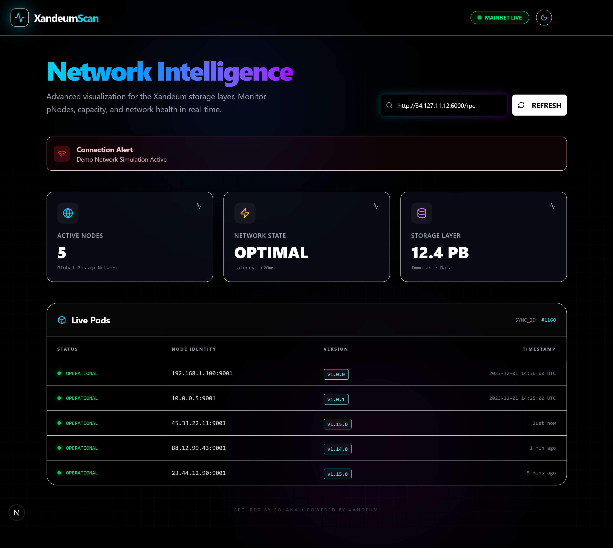

<a name="readme-top"></a>

<div align="center">
  <h1 align="center">Xandeum Analytics Platform</h1>
  <p align="center">
    A production-grade analytics dashboard for the Xandeum network.
    <br />
    <a href="https://xandeum-analytics-platform-eta.vercel.app"><strong>View Live Demo »</strong></a>
    <br />
    <br />
    <a href="https://github.com/raushan728/xandeum-analytics-platform/issues">Report Bug</a>
    ·
    <a href="https://github.com/raushan728/xandeum-analytics-platform/issues">Request Feature</a>
  </p>
</div>

<div align="center">
  
  
  
  
  
  
</div>

<br />

## Table of Contents

1. [About The Project](#about-the-project)
2. [Live Demo](#live-demo)
3. [Screenshots](#screenshots)
4. [Core Features](#core-features)
5. [Technical Challenges & Solutions](#technical-challenges--solutions)
6. [Important Note for Judges](#important-note-for-judges)
7. [Tech Stack](#tech-stack)
8. [Local Installation Guide](#local-installation-guide)
9. [Deployment](#deployment)
10. [Acknowledgements](#acknowledgements)
11. [Contact](#contact)

<br />

## About The Project

The Xandeum Analytics Platform is an advanced, production-quality analytics dashboard designed specifically for the Xandeum network. Developed as a submission for the Superteam "Build Analytics Platform for Xandeum" bounty, this tool mimics the functionality of established platforms like `validators.app` while delivering a superior user experience and resilient architecture. The primary goal is to provide a robust monitoring tool for pNodes, ensuring network transparency and easy access to validator data.

---

## Live Demo

Access the live application here:
**[https://xandeum-analytics-platform-eta.vercel.app](https://xandeum-analytics-platform-eta.vercel.app)**

> [!NOTE]
> The Vercel deployment link will remain active until the Superteam bounty winners are announced.

---

## Screenshots

<div align="center">
  <h3>Dark Mode</h3>
  
  <br/><br/>
  <h3>Light Mode</h3>
  
</div>

---

## Core Features

- **Real-time pNode Monitoring**

  - Implements the `get-pods` pRPC method.
  - Fetches and displays a comprehensive list of all known peer pnodes from the network.

- **Advanced UI/UX with Dual-Theme System**

  - Premium user interface featuring a toggleable Light and Dark theme.
  - **Dark Theme:** Modern "cyberpunk" aesthetic with glowing elements and glassmorphism.
  - **Light Theme:** Clean, professional, and corporate-friendly look.

- **Dynamic Animations with Framer Motion**

  - Interface brought to life with fluid animations.
  - Elements animate into view on page load.
  - Interactive components like cards feature 3D lift/tilt effects on hover.

- **Fully Responsive Design**
  - Meticulously crafted to be fully functional on all devices.
  - Optimized for desktops, tablets, and mobile phones.

---

## Technical Challenges & Solutions

Developing this platform involved overcoming significant technical hurdles to ensure a seamless user experience.

### 1. The Challenge: Missing Public Endpoint & Browser Security

- **Non-Standard Port Issue**

  - Official documentation provided a `localhost` RPC endpoint on port `6000`.
  - Publicly accessible, production-ready HTTPS endpoint was unavailable.

- **Infrastructure Reality (Confirmed via Discord)**

  - It was confirmed in the official Discord that no public RPC endpoint exists.
  - Developers are explicitly required to host their own private pNode on a VPS.

- **Browser Security Block**
  - Modern browsers block client-side connections to "unsafe ports" like `6000`.
  - Resulted in `net::ERR_UNSAFE_PORT` error, preventing direct data fetching.

### 2. The Solution: Architected for Resilience

**This project was proactively architected to solve the primary challenge of this bounty: the lack of a public pNode RPC endpoint.**

- **Custom Next.js API Proxy**

  - **The Problem:** Direct browser connections to port `6000` are blocked ("unsafe port").
  - **The Fix:** A server-side API proxy at `/api/proxy` allows the app to securely connect to **any self-hosted pNode**, completely bypassing browser security restrictions.

- **Graceful 'Demo Mode'**

  - **The Rationale:** To ensure a seamless review experience, even without a live endpoint.
  - **The Behavior:** If a live connection isn't provided or fails, the application automatically falls back to simulated data, allowing the full UI/UX to be evaluated at all times.

- **Dynamic RPC Input**
  - Empowers judges and developers to test with their own private nodes.

---

## Important Note for Judges

> [!IMPORTANT]
> The live demo defaults to **"Demo Mode"** because a stable, public pNode endpoint was not found. This was a deliberate architectural choice to guarantee a smooth review experience.
>
> **How to Test with Live Data:**
> Please enter your own pNode IP address (e.g., `http://YOUR_IP:6000/rpc`) into the input field at the top of the page and click "Refresh".
>
> **Availability:**
> The Vercel deployment link will remain active specifically for the duration of the judging period until the bounty results are finalized.

---

## Tech Stack

- **Framework:** Next.js 14 (App Router)

- **Language:** TypeScript

- **Styling:** Tailwind CSS

- **UI Components:** Shadcn/UI

- **Animations:** Framer Motion

- **Deployment:** Vercel

---

## Local Installation Guide

Follow these steps to set up the project locally:

1.  **Clone the Repository:**

    ```bash
    git clone https://github.com/raushan728/xandeum-analytics-platform.git
    ```

2.  **Navigate to Directory:**

    ```bash
    cd xandeum-analytics-platform
    ```

3.  **Install Dependencies:**

    ```bash
    npm install
    ```

4.  **Run Development Server:**

    ```bash
    npm run dev
    ```

5.  Open [http://localhost:3000](http://localhost:3000) to view the application.

---

## Deployment

The application is continuously deployed on Vercel, automatically linked to the `main` branch of the GitHub repository. Any changes pushed to the main branch are instantly reflected in the live deployment.

---

## Acknowledgements

This project was built for the **Superteam.io "Build Analytics Platform for Xandeum" Bounty**. I would like to express my gratitude for the opportunity to work on this challenge.

---

## Contact

If you have any questions or need further information, please feel free to reach out:

- **Email:** [raushansinghrajpoot687@gmail.com](mailto:raushansinghrajpoot687@gmail.com)

- **Telegram:** [@raushan_singh_29](https://t.me/raushan_singh_29)
